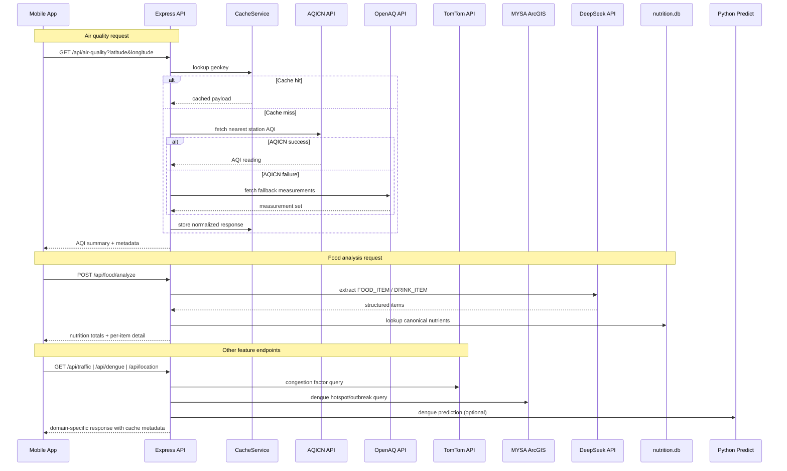
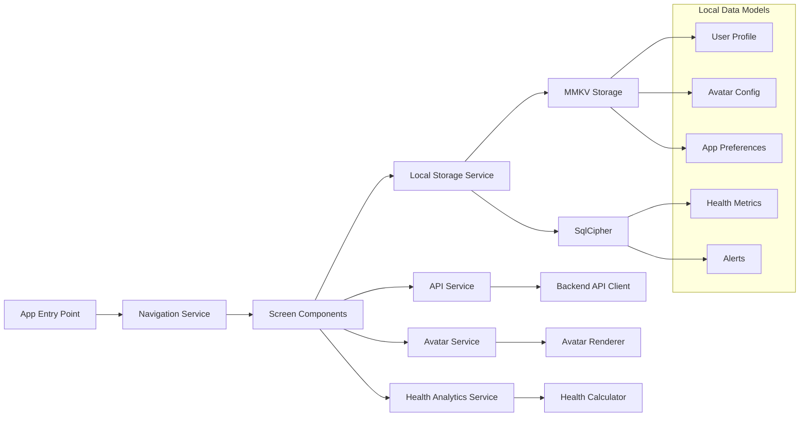
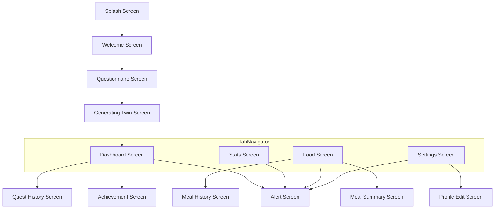
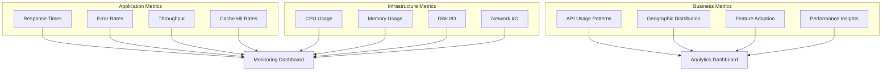

# Digital Twin Application Architecture

## Overview

The Digital Twin application is a privacy-first mobile wellness platform that creates personalized digital avatars based on air quality and personal health data. The architecture follows a hybrid approach with a Node.js backend for air quality data and local device storage for all personal information.

## Core Principles

### Privacy-First Design

- **Zero PII Storage**: No personally identifiable information is stored on backend servers
- **Local-First**: All user-generated data remains on the user's device
- **Minimal Data Transfer**: Only coordinates are sent to backend for air quality data

### Data Segregation

- **Public Data**: Air quality data from OpenAQ and AQICN APIs (backend)
- **Personal Data**: User profiles, avatar preferences, health metrics (local device storage)

## System Architecture

```mermaid
graph TB
    subgraph "Mobile App (React Native)"
        UI[UI Layer] --> LocalStore[Local Storage Service]
        UI --> ApiClient[Backend API Service]
        LocalStore --> MMKV[Encrypted MMKV Store]
        LocalStore --> DeviceDB[SQLCipher]
        ApiClient --> BackendClient[BackendApiService]

        subgraph "Local Data"
            MMKV --> Profile[User Profile]
            MMKV --> Avatar[Avatar Preferences]
            MMKV --> Settings[App Settings]
            DeviceDB --> Health[Health Metrics]
            DeviceDB --> Alerts[Alert History]
        end
    end

    subgraph "Backend (Node.js + TypeScript)"
        BackendClient --> Express[Express App + Middleware]
        Express --> AirCtrl[AirQualityController]
        Express --> TrafficCtrl[TrafficController]
        Express --> DengueCtrl[DengueController]
        Express --> LocationCtrl[LocationController]
        Express --> FoodCtrl[FoodController]
        Express --> AiCtrl[AI Router]

        AirCtrl --> CacheSvc[CacheService]
        TrafficCtrl --> CacheSvc
        DengueCtrl --> CacheSvc
        AirCtrl --> RateLimiter[RateLimiterService]

        subgraph "Domain Services"
            AirCtrl --> AQICNService[AQICNService]
            AirCtrl --> OpenAQService["ApiService (OpenAQ)"]
            TrafficCtrl --> TrafficService[TrafficService]
            DengueCtrl --> DengueService[DengueService]
            DengueCtrl --> PredictService[PredictionService]
            LocationCtrl --> LocationService[LocationService]
            FoodCtrl --> NutritionService[NutritionService]
            FoodCtrl --> DeepseekService[DeepseekService]
            AiCtrl --> DeepseekService
        end

        CacheSvc --> InMemory[(In-memory Cache)]
        NutritionService --> NutritionDB[(nutrition.db)]
        DeepseekService --> OcrWorker[OCR Worker]
        OcrWorker --> OcrAssets[(eng.traineddata)]
    end

    subgraph "External Services"
        AQICNService --> AQICN[AQICN API]
        OpenAQService --> OpenAQ[OpenAQ API]
        TrafficService --> TomTom[TomTom Traffic Flow API]
        DengueService --> MYSA[MYSA ArcGIS Proxy]
        PredictService --> PythonPredict[Python Prediction Service]
        LocationService --> LocationIQ[LocationIQ Autocomplete]
        DeepseekService --> DeepSeek[DeepSeek API]
        DeepseekService -. optional .-> Cloudinary[Cloudinary Uploads]
    end
```



## Data Flow Architecture



## Component Architecture

### Mobile Application (React Native)

#### Core Services



#### Screen Flow



### Backend Services (Node.js)

#### Service Layer Architecture

```mermaid
graph TB
    subgraph "API Gateway Layer"
        Router[Express Router] --> Security[Helmet, CORS, Compression]
        Security --> GlobalRateLimiter[Express Rate Limiter]
        GlobalRateLimiter --> Validation[Request Validation (Zod)]
    end

    subgraph "Controller Layer"
        Validation --> AirCtrl[AirQualityController]
        Validation --> TrafficCtrl[TrafficController]
        Validation --> DengueCtrl[DengueController]
        Validation --> LocationCtrl[LocationController]
        Validation --> FoodCtrl[FoodController]
        Validation --> AiCtrl[AI Router]
    end

    subgraph "Service Layer"
        AirCtrl --> AQICNService[AQICNService]
        AirCtrl --> OpenAQService[ApiService]
        AirCtrl --> RateLimiter[RateLimiterService]
        AirCtrl --> CacheSvc[CacheService]
        TrafficCtrl --> TrafficService[TrafficService]
        TrafficService --> CacheSvc
        DengueCtrl --> DengueService[DengueService]
        DengueService --> CacheSvc
        DengueCtrl --> PredictionService[PredictionService]
        LocationCtrl --> LocationService[LocationService]
        FoodCtrl --> NutritionService[NutritionService]
        FoodCtrl --> DeepseekService[DeepseekService]
        AiCtrl --> DeepseekService
    end

    subgraph "Internal Data"
        CacheSvc --> InMemory[(In-memory cache)]
        NutritionService --> NutritionDB[(nutrition.db)]
        DeepseekService --> OcrWorker[OCR Worker]
        OcrWorker --> OcrAsset[(eng.traineddata)]
    end

    subgraph "External Integrations"
        AQICNService --> AQICN[AQICN API]
        OpenAQService --> OpenAQ[OpenAQ API]
        TrafficService --> TomTom[TomTom Traffic Flow]
        DengueService --> MYSA[MYSA ArcGIS Proxy]
        PredictionService --> PythonPredict[Python Predict Service]
        LocationService --> LocationIQ[LocationIQ Autocomplete]
        DeepseekService --> DeepSeek[DeepSeek API]
        DeepseekService -. optional .-> Cloudinary[Cloudinary Uploads]
    end
```

## Data Storage

### In-Memory Cache Structure

The backend uses a simple in-memory cache for air quality data with TTL (Time To Live) support:

```typescript
interface CacheItem<T> {
  data: T;
  expiresAt: number;
  createdAt: number;
}

// Cache keys are generated based on coordinates
// Example: "air_quality_3.139_101.687"
```

### Local Storage Schema (MMKV)

```typescript
interface UserProfile {
  location: {
    latitude: number;
    longitude: number;
  };
  commuteMode: 'car' | 'transit' | 'wfh' | 'bike' | 'walk';
  sleepHours: number;
  gender: 'male' | 'female';
  skinTone: 'light' | 'medium' | 'dark';
  createdAt: string; // ISO 8601 date string
  schemaVersion?: number; // For future data migrations
  // Optional fields for future avatar customization
  ageRange?: 'young' | 'adult' | 'senior';
  preferredStyle?: 'casual' | 'professional' | 'sporty';
  // Security settings
  security?: {
    requireAuthentication: boolean;
    authMethod?: 'pin' | 'biometric' | 'both';
    lastAuthenticatedAt?: string;
  };
}
```

## API Design

### RESTful Endpoints

```yaml
# Air Quality
GET /api/air-quality?latitude={lat}&longitude={lon}
GET /api/air-quality/status
POST /api/air-quality/clear-cache
GET /api/air-quality/health

# AQICN Endpoints
GET /api/air-quality/aqicn?latitude={lat}&longitude={lon}
GET /api/air-quality/aqicn/station/{stationId}
GET /api/air-quality/aqicn/search?latitude={lat}&longitude={lon}&radius={km}
POST /api/air-quality/aqicn/clear-cache

# General Health Check
GET /api/health
```

### Response Format

```typescript
interface APIResponse<T> {
  success: boolean;
  data?: T;
  error?: string;
  metadata?: {
    cached: boolean;
    cacheAge?: number;
    rateLimit?: {
      remaining: number;
      resetTime: number;
    };
  };
}
```

## Security Architecture

### Data Protection

```mermaid
graph TB
    subgraph "Client Safeguards"
        Biometrics[Biometric / PIN Guard] --> LocalEncrypt[Encrypted MMKV Storage]
        LocalEncrypt --> Pinning[Certificate Pinning]
    end

    subgraph "Transport Security"
        Pinning --> TLS[HTTPS (TLS 1.2+)]
        TLS --> Gateway[Express Gateway with Helmet & CORS]
    end

    subgraph "Backend Hardening"
        Gateway --> RateLimit[Global Rate Limiting]
        RateLimit --> Validation[Zod Validation & Sanitisation]
        Validation --> Errors[Centralised Error Handler]
    end

    subgraph "Operational Controls"
        Errors --> Logging[Structured Logging & Request Tracing]
        Logging --> Monitoring[Health/Status Endpoints]
        Monitoring --> Secrets[Environment-based Secrets]
    end
```

### Privacy Controls

- **Data Minimization**: Only collect necessary environmental coordinates
- **Anonymization**: Hash IP addresses and remove identifying headers
- **Retention Policies**: Automatic cleanup of old environmental data
- **User Control**: Complete local data export and deletion capabilities

## Performance Architecture

### Caching Strategy

```mermaid
graph LR
    Request[Controller request] --> Check{Cache hit?}
    Check -->|Yes| Serve[Return cached payload + cacheAge]
    Check -->|No| Fetch[Call domain service]
    Fetch --> Normalise[Normalise & enrich response]
    Normalise --> Store[CacheService.set(key, data, ttl)]
    Store --> Serve

    subgraph "CacheService Internals"
        Check --> CacheGet[cache.get(key)]
        Store --> CacheSet[cache.set(key, data, ttl)]
        CacheSet --> Memory[(In-memory map)]
    end
```

### Optimization Strategies

- **Geographic Clustering**: Cache data by coordinate regions (rounded to 3 decimal places)
- **TTL-based Expiration**: 30-minute default cache expiration for air quality data
- **Rate Limiting**: Prevent API abuse with configurable request limits
- **Compression**: Gzip responses and optimize payload sizes

## Deployment Architecture

### Infrastructure Overview

```mermaid
graph TB
    subgraph "Clients"
        IOS[iOS App]
        Android[Android App]
    end

    subgraph "Backend Runtime"
        Express[Node.js Express API]
        Python[Python Prediction Service]
    end

    subgraph "Local Assets"
        Nutrition[(nutrition.db)]
        Ocr[(eng.traineddata)]
    end

    subgraph "External APIs"
        AQICN[AQICN]
        OpenAQ[OpenAQ]
        TomTom[TomTom Traffic Flow]
        MYSA[MYSA ArcGIS]
        LocationIQ[LocationIQ]
        DeepSeek[DeepSeek]
        Cloudinary[Cloudinary (optional)]
    end

    IOS --> Express
    Android --> Express

    Express --> AQICN
    Express --> OpenAQ
    Express --> TomTom
    Express --> MYSA
    Express --> LocationIQ
    Express --> DeepSeek
    Express -. optional .-> Cloudinary
    Express --> Nutrition
    Express --> Ocr
    Express --> Python
    Python --> Express
```

### Environment Configuration

#### Development

- In-memory cache for air quality data
- Direct external API access (OpenAQ, AQICN)
- Hot reloading enabled
- Development logging

#### Production

- In-memory cache with TTL
- Rate-limited external API access
- Comprehensive monitoring and alerting
- Production logging and error handling

## Monitoring & Observability

### Metrics Collection



### Health Checks

- **Application Health**: API endpoint responsiveness
- **Cache Health**: In-memory cache status and memory usage
- **External API Health**: OpenAQ and AQICN service availability
