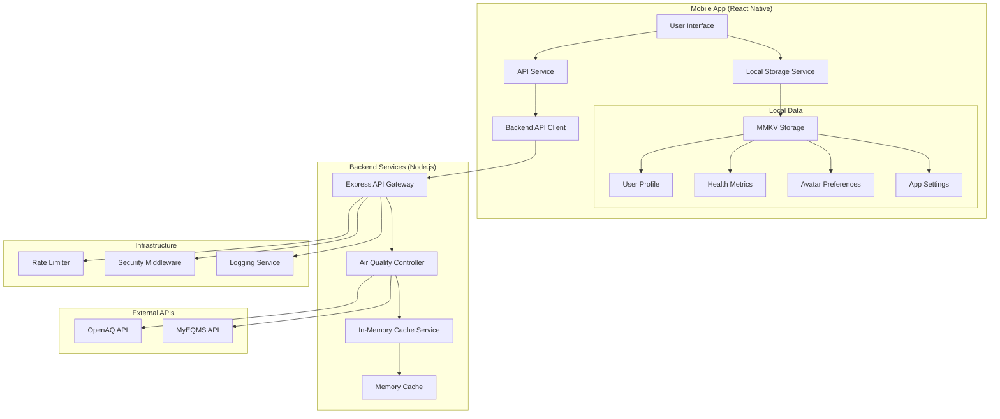
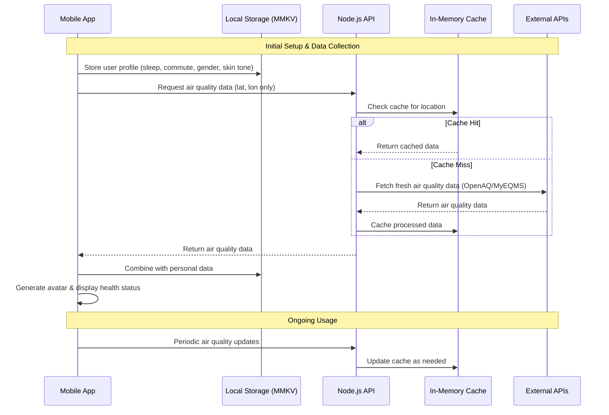
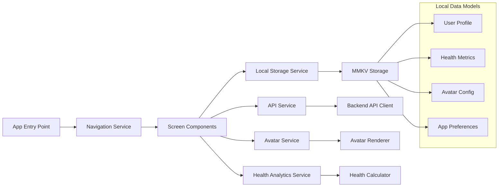
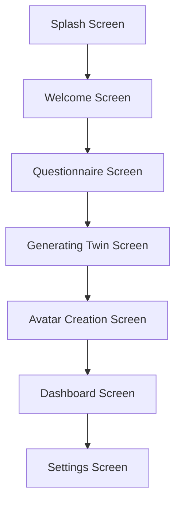
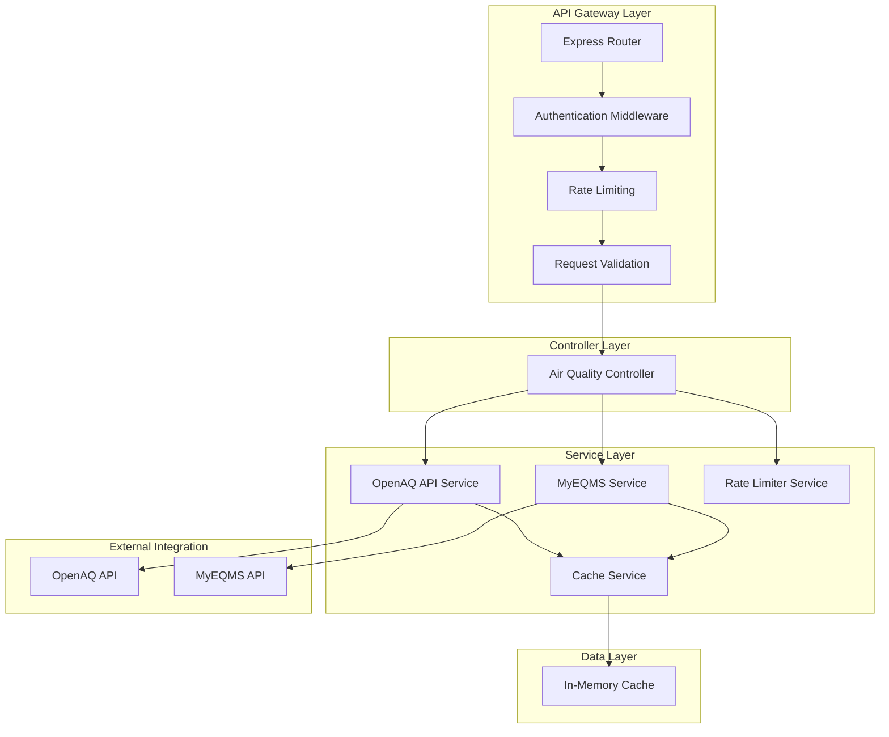
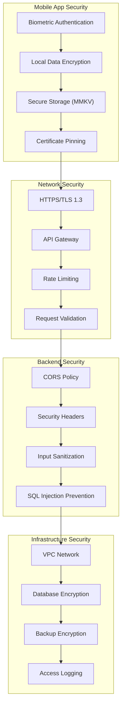
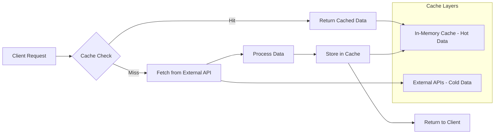
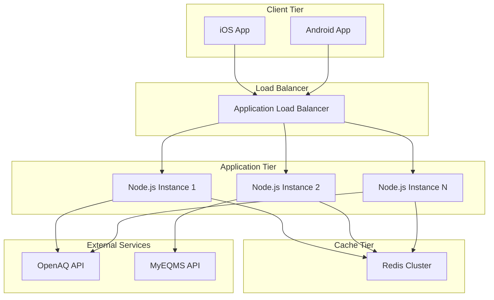
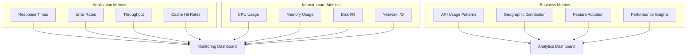

# Digital Twin Application Architecture

## Overview

The Digital Twin application is a privacy-first mobile wellness platform that creates personalized digital avatars based on air quality and personal health data. The architecture follows a hybrid approach with a Node.js backend for air quality data and local device storage for all personal information.

## Core Principles

### Privacy-First Design

- **Zero PII Storage**: No personally identifiable information is stored on backend servers
- **Local-First**: All user-generated data remains on the user's device
- **Minimal Data Transfer**: Only coordinates are sent to backend for air quality data

### Data Segregation

- **Public Data**: Air quality data from OpenAQ and MyEQMS APIs (backend)
- **Personal Data**: User profiles, avatar preferences, health metrics (local device storage)

## System Architecture



## Data Flow Architecture



## Component Architecture

### Mobile Application (React Native)

#### Core Services



#### Screen Flow



### Backend Services (Node.js)

#### Service Layer Architecture



## Data Storage

### In-Memory Cache Structure

The backend uses a simple in-memory cache for air quality data with TTL (Time To Live) support:

```typescript
interface CacheItem<T> {
  data: T;
  expiresAt: number;
  createdAt: number;
}

// Cache keys are generated based on coordinates
// Example: "air_quality_3.139_101.687"
```

### Local Storage Schema (MMKV)

```typescript
interface UserProfile {
  location: {
    latitude: number;
    longitude: number;
  };
  commuteMode: 'car' | 'transit' | 'wfh' | 'bike' | 'walk';
  sleepHours: number;
  gender: 'male' | 'female';
  skinTone: 'light' | 'medium' | 'dark';
  createdAt: string; // ISO 8601 date string
  schemaVersion?: number; // For future data migrations
  // Optional fields for future avatar customization
  ageRange?: 'young' | 'adult' | 'senior';
  preferredStyle?: 'casual' | 'professional' | 'sporty';
  // Security settings
  security?: {
    requireAuthentication: boolean;
    authMethod?: 'pin' | 'biometric' | 'both';
    lastAuthenticatedAt?: string;
  };
}
```

## API Design

### RESTful Endpoints

```yaml
# Air Quality
GET /api/air-quality?latitude={lat}&longitude={lon}
GET /api/air-quality/status
POST /api/air-quality/clear-cache
GET /api/air-quality/health

# Malaysian Air Quality (MyEQMS)
GET /api/air-quality/malaysia?latitude={lat}&longitude={lon}&radius={km}
GET /api/air-quality/malaysia/stations
GET /api/air-quality/malaysia/state/{state}
GET /api/air-quality/malaysia/region/{region}
GET /api/air-quality/malaysia/station/{stationId}
GET /api/air-quality/malaysia/station/{stationId}/trend

# General Health Check
GET /api/health
```

### Response Format

```typescript
interface APIResponse<T> {
  success: boolean;
  data?: T;
  error?: string;
  metadata?: {
    cached: boolean;
    cacheAge?: number;
    rateLimit?: {
      remaining: number;
      resetTime: number;
    };
  };
}
```

## Security Architecture

### Data Protection



### Privacy Controls

- **Data Minimization**: Only collect necessary environmental coordinates
- **Anonymization**: Hash IP addresses and remove identifying headers
- **Retention Policies**: Automatic cleanup of old environmental data
- **User Control**: Complete local data export and deletion capabilities

## Performance Architecture

### Caching Strategy



### Optimization Strategies

- **Geographic Clustering**: Cache data by coordinate regions (rounded to 3 decimal places)
- **TTL-based Expiration**: 30-minute default cache expiration for air quality data
- **Rate Limiting**: Prevent API abuse with configurable request limits
- **Compression**: Gzip responses and optimize payload sizes

## Deployment Architecture

### Infrastructure Overview



### Environment Configuration

#### Development

- In-memory cache for air quality data
- Direct external API access (OpenAQ, MyEQMS)
- Hot reloading enabled
- Development logging

#### Production

- In-memory cache with TTL
- Rate-limited external API access
- Comprehensive monitoring and alerting
- Production logging and error handling

## Monitoring & Observability

### Metrics Collection



### Health Checks

- **Application Health**: API endpoint responsiveness
- **Cache Health**: In-memory cache status and memory usage
- **External API Health**: OpenAQ and MyEQMS service availability

## Development Workflow

### Local Development Setup

```bash
# Backend setup
cd backend
npm install
cp .env.example .env
npm run dev

# Mobile app setup
cd app
npm install
npx pod-install  # iOS only
npm start
```

### Testing Strategy

- **Unit Tests**: Individual service and component testing
- **Integration Tests**: API endpoint and database interaction testing
- **E2E Tests**: Complete user flow testing
- **Performance Tests**: Load testing and benchmarking

## Current Implementation Status

### Implemented Features

#### Mobile App (React Native)

- ✅ User onboarding flow (Splash → Welcome → Questionnaire → Avatar Creation → Dashboard)
- ✅ Local storage using MMKV for user profiles
- ✅ 3D avatar rendering with Three.js
- ✅ Air quality data integration
- ✅ Avatar customization (skin tone, gender-based models)
- ✅ Settings screen

#### Backend (Node.js)

- ✅ Express API with security middleware (helmet, CORS, rate limiting)
- ✅ Air quality data from OpenAQ API
- ✅ Malaysian air quality data from MyEQMS API
- ✅ In-memory caching with TTL
- ✅ Rate limiting and request validation
- ✅ Health check endpoints

### Not Yet Implemented

- ❌ Weather data integration
- ❌ Database persistence (PostgreSQL/Redis)
- ❌ Advanced health analytics
- ❌ Push notifications
- ❌ Data export functionality
- ❌ Biometric authentication
- ❌ Advanced avatar animations based on health status

### Future Considerations

#### Scalability Enhancements

- **Database Integration**: Add PostgreSQL for data persistence and analytics
- **Redis Caching**: Replace in-memory cache with Redis for scalability
- **Microservices**: Split services by domain (air quality, weather, analytics)
- **Geographic Sharding**: Distribute data by geographic regions

#### Feature Expansions

- **Weather Integration**: Add weather data to complement air quality information
- **Machine Learning**: Predictive health insights based on environmental patterns
- **Real-time Updates**: WebSocket connections for live environmental data
- **Wearable Integration**: Sync with fitness trackers and health devices

This architecture accurately reflects the current implementation while providing a roadmap for future enhancements.
