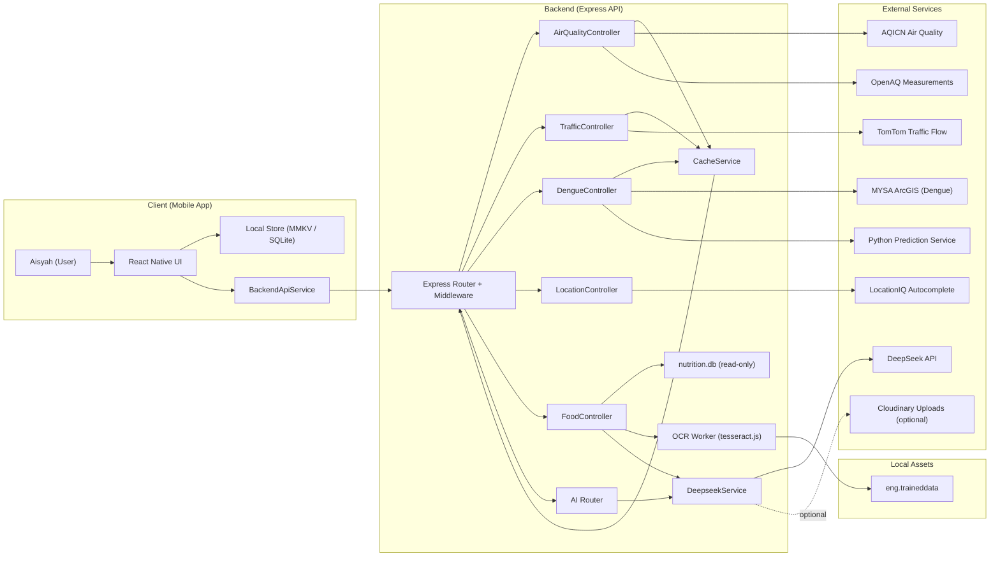

Key notes

- The backend now exposes dedicated controllers for air quality, traffic, dengue intelligence, location autocomplete, food analysis, and AI extraction. Shared middleware (Helmet, CORS, compression, rate limiting, request logging) sits ahead of the router.
- `CacheService` provides in-memory caching for geospatial calls (air quality, traffic, dengue) with TTLs tuned per domain, while rate limiting protects upstream quotas (OpenAQ, AQICN).
- Food analysis relies on `DeepseekService` for multimodal extraction, optional OCR (`eng.traineddata`) for receipts, and `nutrition.db` for canonical nutrient lookups.
- The dengue controller fans out to both MYSA's ArcGIS proxy for hotspot/outbreak data and the Python prediction microservice for state forecasts.
- Optional integrations (Cloudinary uploads, Python service) are isolated so the mobile app can still function against the core Node backend when those services are unavailable.
