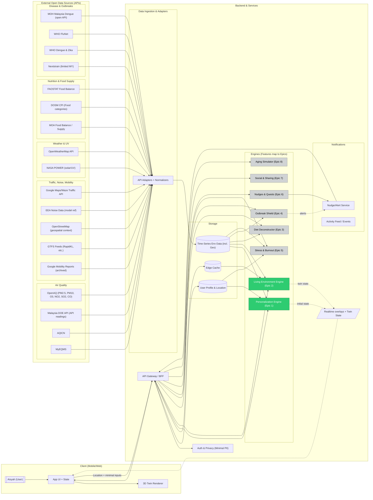

Key notes

- Data ingestion: Pulls from open APIs on schedule, normalizes to a common schema, and streams into time-series and geospatial stores.
- Epic mapping: Personalization (Epic 1) computes initial twin; Living Environment (Epic 2) drives real-time visual effects; other engines are planned.
- Client flow: App sends location and minimal inputs; receives twin state and overlays via API for rendering.
- Privacy: Minimal PII, with profile/preferences separated from environmental data.
- Next step: I can add a variant diagram focused on Epic 1–2 data flows or save this in your repo (e.g., docs/architecture.mmd).
